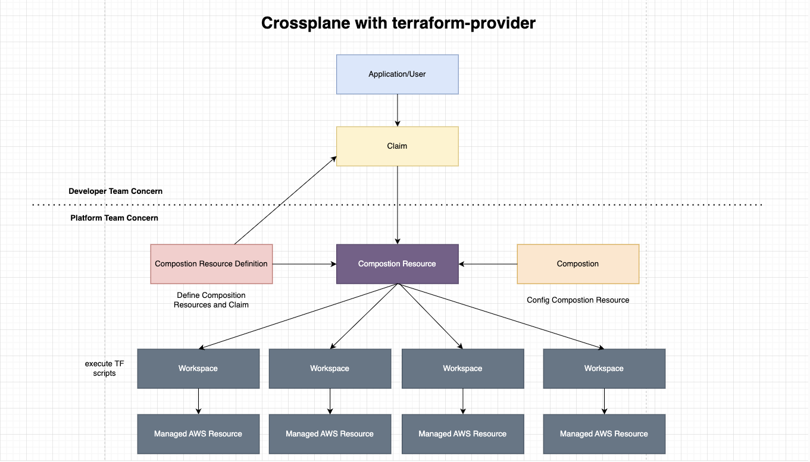

# ops-kube-crossplane-terraform

### Concept of crossplane with terraform provider

### Investigate Scenarios

- As a user, I would like to create a dynamodb with `Remote terraform moudle`.
  - Workspace mode -> passed
  - Composition mode -> passed

- As a user, I would like to create a s3 bucket with `terraform inline code` .
  - Workspace mode -> passed
  - Composition mode -> passed

- As a user, I would like to setup Kuernetes Secrets as terraform backend to store the state. 
  - tf-status in the secrets of `upbound-system` namespace. eg:
    - tfstate-workspace-crossplane-terraform-s3-alpha-apse2-v1-crossplane-terraform-provider-config-alpha-apse2-v1

- As an admin user, I would like to config IRSA for terraform-provider.

- As a user/admin user, how could I debug the issues.
  - k get s3
  - k get dynamodb
  - k get Composition

  - k get workspace
  - k describe ...

- As a user/admin user, I would like to delete workspace resource.
  - AWS resources wil be deleted as well
  - Notes: 
    - Need to remove `finalizer` in workspace first

- As a user/admin user, I would like to delete Compoistion `Claim` resource. 
  - Workspace will be deleted. 
  - AWS resources wil be deleted as well

- As a admin user, I would like to upgrade my version from v1beta1 to v1beta2. (As there are breaking changes betwwen these two versions.)
  - create v1beta1 & v1beta2 use different tf files. eg: compositions/dynamodb

- As a admin user, how do I migrate existing AWS Resources (RDS) into this compostion mode. ??

### Issus (01/05/2023)
- add `writeConnectionSecretToRef` in Composition resource will cause `workspace` could not be created.

### Known limits (01/05/2023)
- https://github.com/upbound/provider-terraform/blob/main/README.md#known-limitations

- Not support `remote backend state` with ProviderConfig for compostion mode. eg: s3
  - https://github.com/upbound/provider-terraform/issues/49

- Not support `CompositeResourceDefinition` with multiple apiVersions.

### Hackway to get more terraform features  (02/05/2023)
- The terraform features are not offically support yet:
  - `terraform plan` show diff for us
    - https://github.com/upbound/provider-terraform/issues/86

  - `state lock` issue during pod restart/update
    - https://github.com/crossplane-contrib/provider-terraform/issues/46

  - `import values` to existing terraform status.  

- Hackway steps:
  - kubectl get pods -n upbound-system 
  - kubectl exec -it crossplane-provider-terraform-* -- bash
    - cd /tf/<3ae97dd0-e129-4af4-baf5-d8da03b1dcc1>
    - terraform init
    - terraform plan
    - terraform apply
    - terraform import
    - terraform force-unlock <3ae97dd0-e129-4af4-baf5-d8da03b1dcc1>
  - Note:
    - `3ae97dd0-e129-4af4-baf5-d8da03b1dcc1` is the UID of the k8s resource.  

